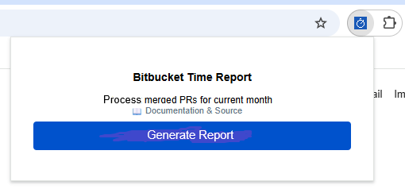

# Bitbucket Time Report Chrome Extension

A Chrome extension that processes merged pull requests from Bitbucket for the current month and formats them for easy reporting.

> The extension works only with merged PRs. It counts the day the PR was merged as the task completion date.<br/><br/>
> **It does not process your open/pending PRs nor current task(-s) in progress, so you have to process them manually in case those have to be reported.** <br/>
> **Ensure the correctness of results before submitting time report.**


## Features

- **Configurable organization and project settings** - Works with any Bitbucket repository
- Automatically detects your Bitbucket user UUID
- Navigates to your merged pull requests for the current month
- Processes data from all pages (handles pagination)
- Skips weekend days (Saturday and Sunday), as these are typically non-working days
- Formats output as: `(D) <F/B>, <P/D>: <PR Title>`
  - D = Date in the format: `<Month> <Day Of Month>, <Day Of Week>`, e.g. January 1, Monday
  - F = Feature, B = Bug (auto-detected based on branch name/title)
  - P = In Progress, D = Done
- Provides copy-to-clipboard functionality

## Installation

### Option 1: Chrome Web Store (Recommended)

Install directly from the [Chrome Web Store](https://chromewebstore.google.com/detail/bitbucket-time-report/fmmhfegmdgkblngmeaooiaecippkbfpj).

### Option 2: Manual Installation (Developer Mode)

1. Open Chrome and navigate to `chrome://extensions/`
2. Enable "Developer mode" in the top right
3. Click "Load unpacked" and select this folder
4. The extension will appear in your toolbar

## Configuration

⚠️ **Important**: You must configure your Bitbucket organization and project before using the extension.

1. Right-click the extension icon and select "Options" (or go to `chrome://extensions/` → click "Details" on this extension → click "Extension options")
2. Enter your Bitbucket organization name (e.g., `mycompany`)
3. Enter your repository/project name (e.g., `my-project`)
4. Click "Save Settings"

The URL format will be: `https://bitbucket.org/<organization>/<project>/pull-requests/...`

**Example**: If your Bitbucket URL is `https://bitbucket.org/acme-corp/web-app/pull-requests/`, then:
- Organization: `acme-corp`
- Project: `web-app`


## Usage

1. **Configure the extension** (see Configuration section above)
2. Make sure you're logged into Bitbucket
3. Click the extension icon in your Chrome toolbar
4. Click "Generate Report" (The extension will operate in the current tab, run the extension in a new tab if you don't want to lose the progress):

5. The extension will:
   - Get your user UUID:
   
   - Load your configured organization and project settings
   - Navigate to the configured repository:
   
   - Process all merged PRs from the current month
   - Format and display the results:
   
6. Click "Copy to Clipboard" to copy the formatted list

## Output Format

Each report entry is formatted as:
```
(August 4, Thursday) F, D: ABC-1010: Add new feature for user authentication 

(August 3, Wednesday) F, P: ABC-1010: Add new feature for user authentication

(August 2, Tuesday) B, D: ABC-5050: Fix login validation issue

(August 1, Monday) B, P: ABC-5050: Fix login validation issue
```

Where:
- `D` = Date (auto-detected)
- `F` = Feature, `B` = Bug (auto-detected)
- `P` = In Progress (assumed to occupy dates between the completion of the previous task and the current one, but can also be done in the same day along with other task(-s)), `D` = Done (PR is created, task is considered as Done)
- Title is the PR title

## Permissions

The extension requires:
- `activeTab` - To interact with the current tab
- `storage` - To store temporary data
- Host permission for `bitbucket.org` - To access Bitbucket pages

## Troubleshooting

- **Configuration Issues**:
  - Make sure you've configured your organization and project in the extension options
  - Verify the organization and project names match your Bitbucket URL exactly
  - Check that you have access to the configured repository
- **General Issues**:
  - Make sure you're logged into Bitbucket
  - If the extension fails to find your UUID, try refreshing the Bitbucket page first
  - The extension works best on the main Bitbucket domain (bitbucket.org)
  - Avoid clicking or typing while extension generating reports to prevent cases when the extension popup disappears along with results
  - If Pull Requests page gets opened but nothing happens (extensions popup may disappear as well), try to re-run the report generation by opening the extension popup and clicking "Generate Report"
